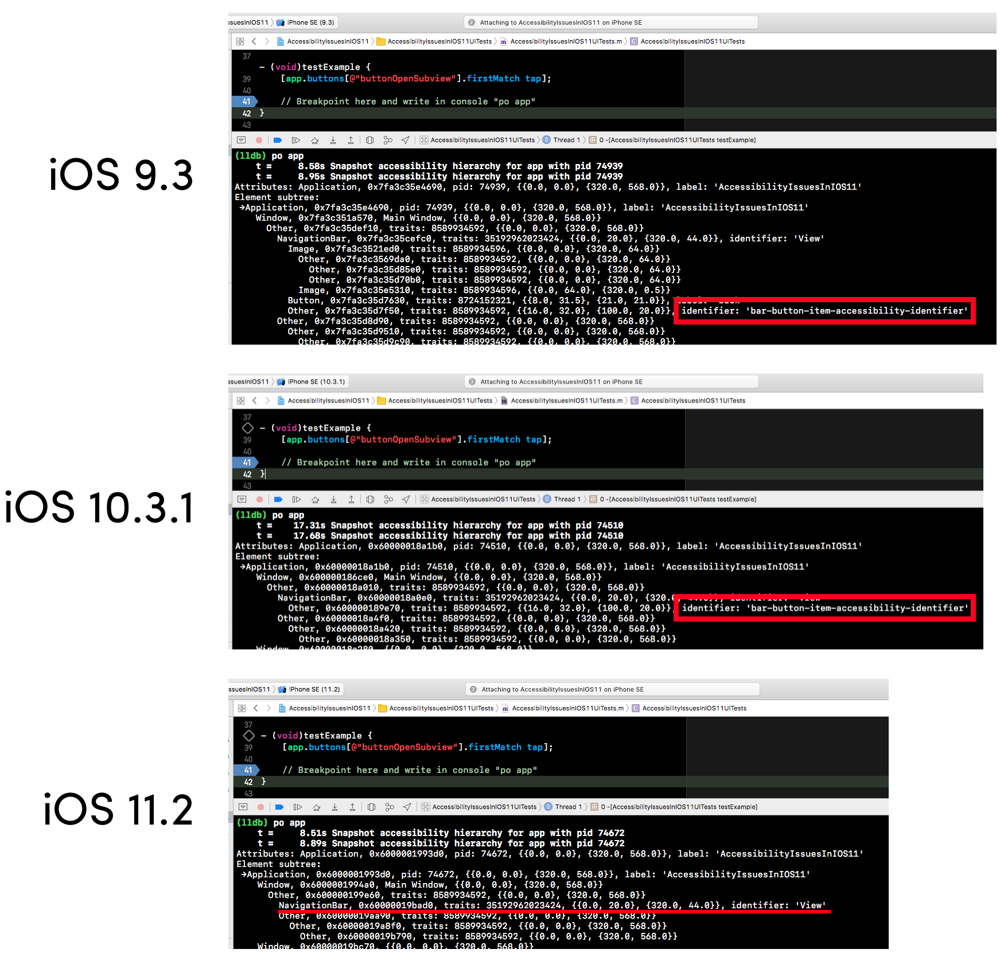

# This shows an issue on iOS 11 where the accessibilityIdentifier on a UIBarButtonItem does not show up when e.g. UI testing

## HowTo

### Setup

1. Fix possible signing stuff (set your account, change bundle identifier etc)

### Working case

1. Set a breakpoint where mentioned in the UI test comment
1. Pick iOS 9 or 10 simulator
1. Run the testExample in the UI test
1. Write "po app" to print the UI data
1. Observe the accessibilityIdentifier

### Broken case

1. Pick iOS 11 simulator
1. Run the testExample in the UI test
1. Write "po app" to print the UI data
1. Observe that the accessibilityIdentifier is missing from the output

## Screenshots

In case you are lazy, here are screenshots.

